# Semester project 2023 - INFT2508 Cross-platform Applications Development for Mobile Devices

**Student**: Francesca Grimaldi <br>
**Date**: 01/12/2023

## Product description and features
The goal of the semester project is to implement an e-commerce food marketplace, following the given instructions. 
In the app, sellers may upload and display items so potential customers can view and buy them.
The **Foodora App** is a similar example out in the market, and has been used as inspiration for the development of this project.

The **main features** of the app are the following:
* the landing page is provided in both <u>thumbnails</u> and <u>map</u> view
* products can be searched by <u>name</u> or filtered by <u>category</u>
* each product has their <u>dedicated page</u>, with detailed description and photo gallery
* the user has the possibility of adding items to their shopping <u>cart</u> or marking them as <u>favourites</u>
* <u>language</u> and <u>theme</u> of the app can be changed

### Landing page
The landing page, which can be visualized in **thumbnails** or **map** view, is the one that shows a preview of all the available food products.

On the upper part of the page, both versions feature:
* a **search bar**, to retrieve specific items by their name;
* a **filter menu**, that can be opened by clicking on the filter icon besides the search bar, and allows users to only visualize the items belonging to the selected categories.

The **bottom bar** gives users the possibility to easily navigate among the main sections of the app.

#### Thumbnails view
This is what the thumbnails view looks like.

<p align="center">
  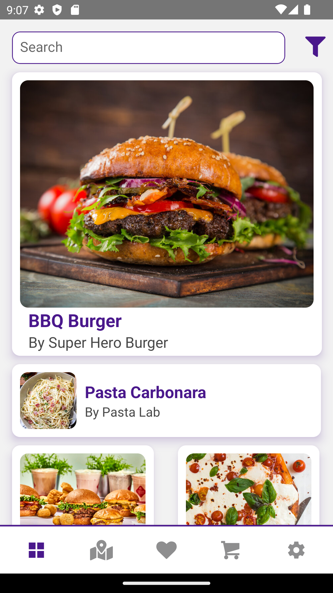
  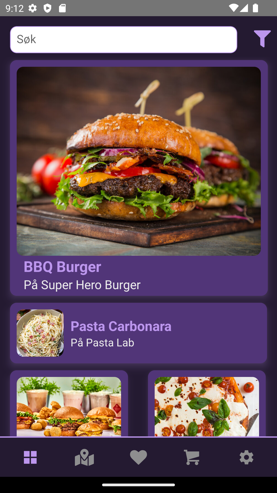

  **Figure 1.** (a) Homepage in Light mode (English). (b) Homepage in Dark mode (Norwegian).
</p>

The products are arranged in various-sized cards. In particular, a pattern of the following four objects repeats: one **big** card, one **medium** card and two smaller **sided** cards.
The only differences between these representations are in the size and placement on the page; otherwise, they all include the image of the item, its name and that of the seller.
All the items are shown using the same card – the **medium** one – when searching or filtering, to provide a more straightforward and clear visualization of the products.

<p align="center">
  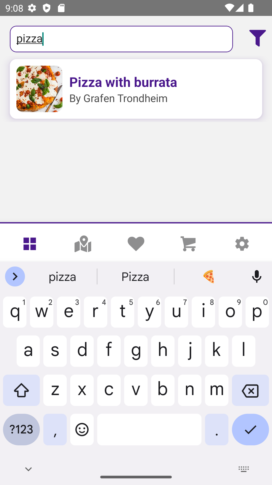
  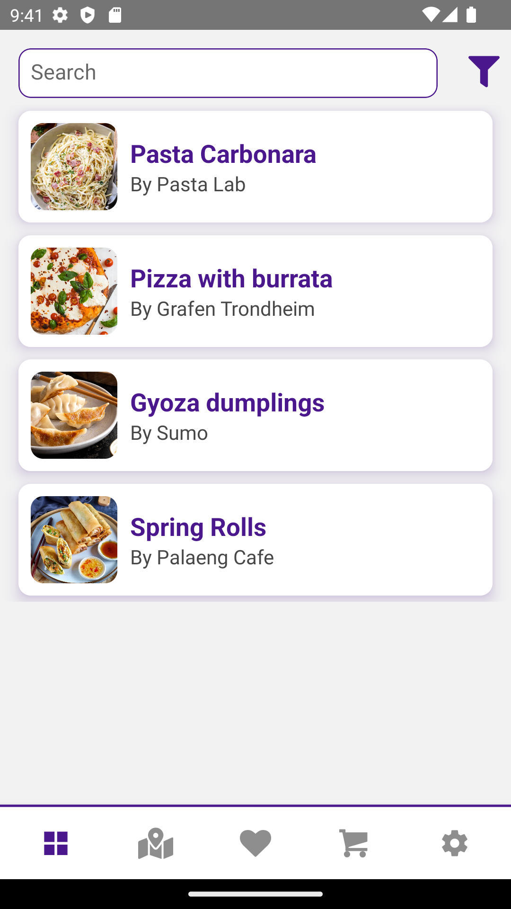

  **Figure 2.** (a) Searching by name.  (b) Filtered items (Italian and Asian cuisine).
</p>

By clicking on an item, the page containing its details (described later) is opened.

#### Map view
The entire screen is taken up by a map that initially opens in the city of Trondheim, but that can be zoomed and explored by the user as they wish.
It was implemented using **Google Maps** API (more later).
Each item is placed on it through a location **marker**, based on the position of its seller. Selecting a marker reveals the product's name and seller, and by pressing on the **callout** it is possible to access the detailed page (described later) of the product.
As per the thumbnails view, items can be searched and filtered.

<p align="center">
  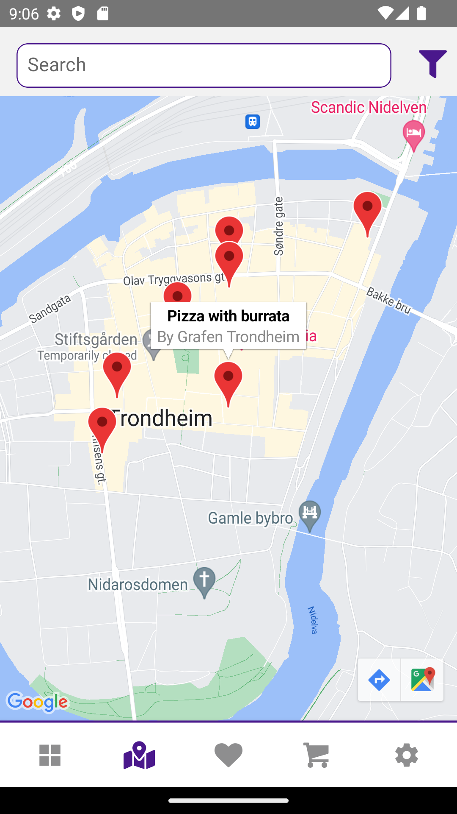
  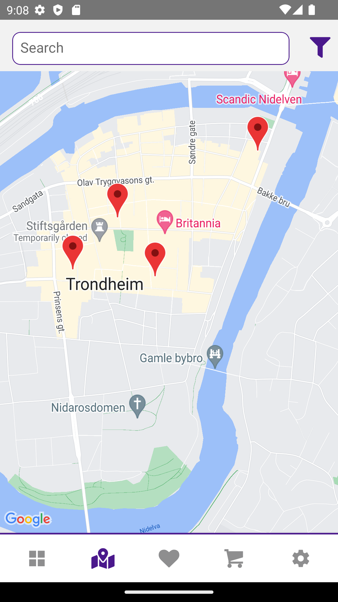

  **Figure 3.** (a) Map view.  (b) Filtered items on map (Italian and Asian cuisine).
</p>

### Filters page
This page is displayed when the user clicks on the filter icon in the upper bar of the main screen.
From here, they can select one or more **categories** that they want to see the products of. In this case, it would be the different types of cuisine.
By clicking on the back arrow, they can return to the landing page and visualize the filtered list of items.

<p align="center">
  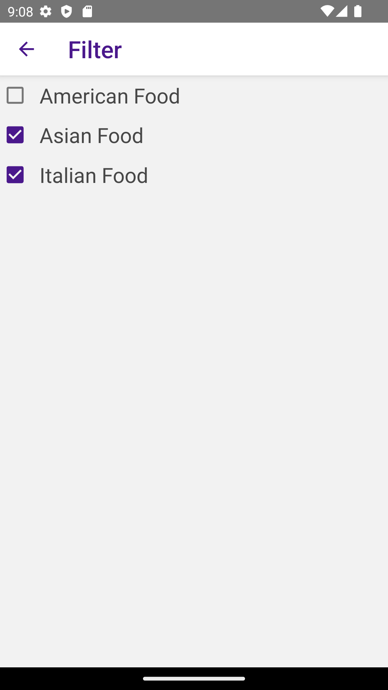
  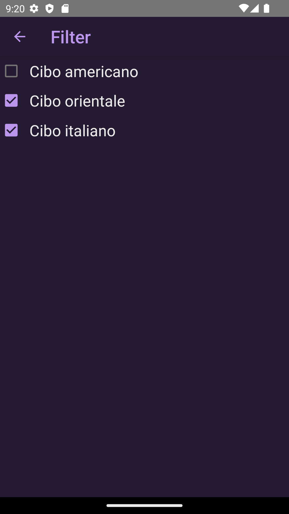

  **Figure 4.** (a) Filters page in Light mode (English).  (b) Filters page in Dark mode (Italian).
</p>


### Item details
This page holds all the information related to one specific product, and is shown when a user clicks on the item preview from a main screen.
The item **name** and seller's name are shown in a large title at the start of the page. One **image** that serves as a representation of the product comes next, and on the right are the heart and cart logos, along with the price.
The **heart logo** can be clicked on to mark an item as favorite or to remove it. The heart is completely colored when it is in the bookmarks and empty when it is not, making it easy to distinguish between these two activities. Similarly, the item is added to the user's shopping basket when they press on the **cart logo**.
After a short description of the dish, four other images are presented as **picture gallery**. Upon click, the image opens as a dialog; it can be zoomed by pinching, and closed through the **x** button or swiping up.

<p align="center">
  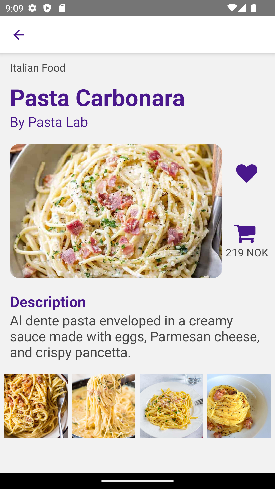
  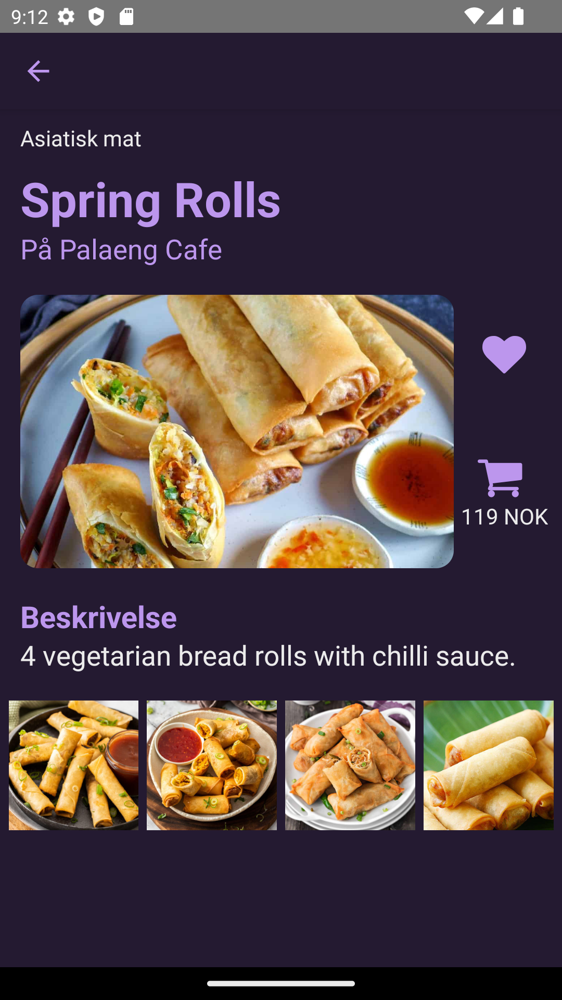
  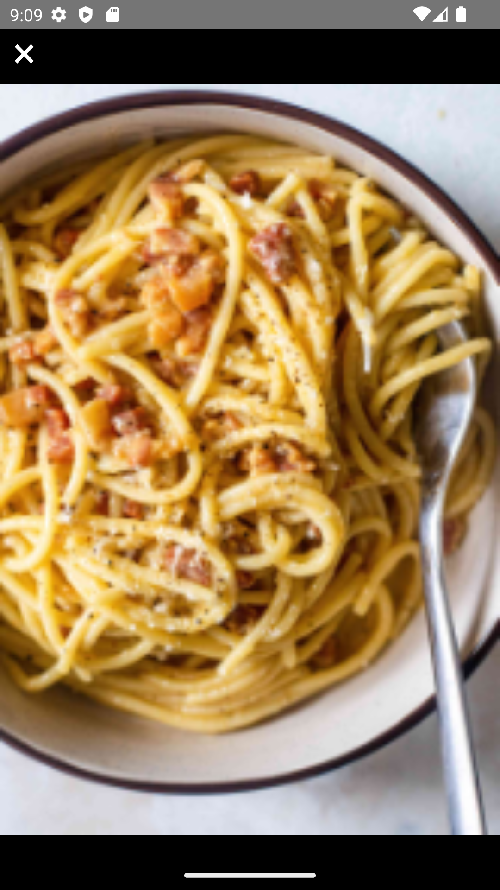

  **Figure 5.** (a) Item details page in Light mode (English).  (b) Item details page in Dark mode (Norwegian).  (c\) Opened image.
</p>

### My Favourites
The bookmarked page is displayed upon click on the **heart** logo of the bottom bar, and contains a list of the items that the user has selected as favourites.
For their representation, the **medium** item card is used. By clicking on it, users are navigated to the item details page.

<p align="center">
  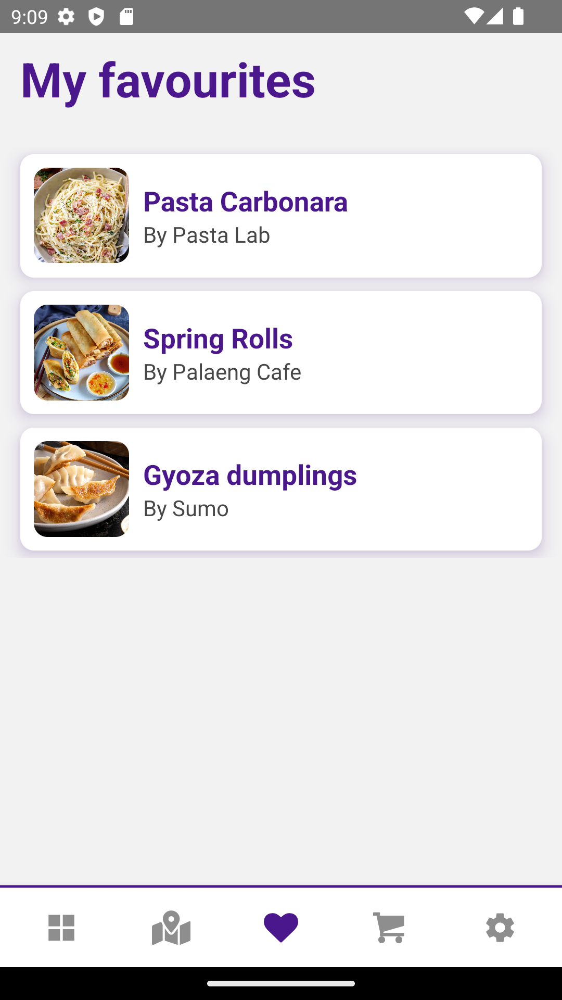
  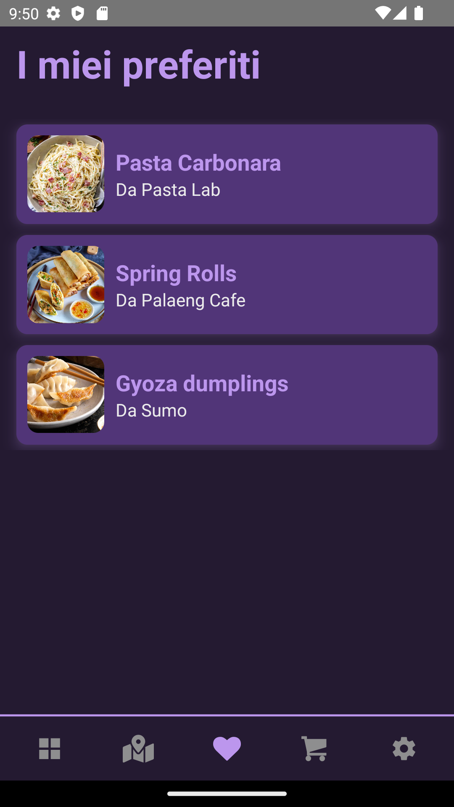

  **Figure 6.** (a) Bookmarks page in Light mode (English).  (b) Bookmarks page in Dark mode (Italian).
</p>

### Shopping Cart
The shopping cart page contains a summary of the items in the cart, additional recommendations, and buttons to reset the cart or buy.
The **summary** includes names of the products along with their quantities, the estimated delivery time, and details on the pricing (subtotal, fees and total).
Personalized **suggestions** are given according to the type of goods in the cart. For instance, if a person has a dish that is categorized as "American food", other products that fall under that category will be recommended to them. These can be browsed by scrolling horizontally.

<p align="center">
  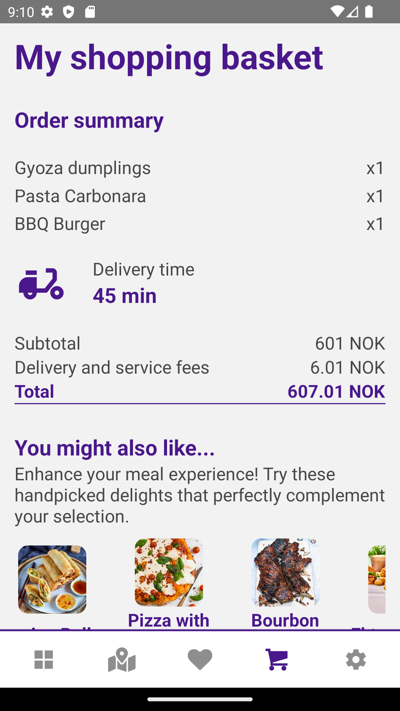
  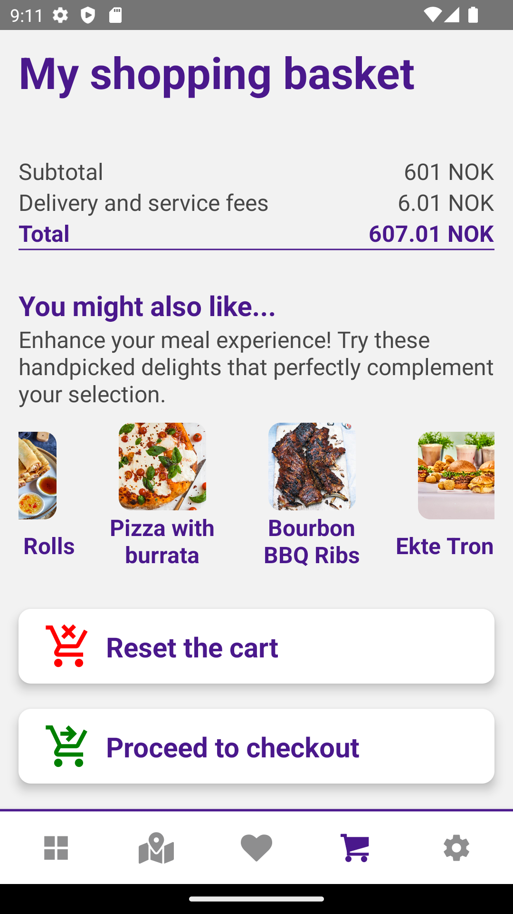

  **Figure 7.** (a) Shopping cart page.  (b) Shopping cart page (cont.).
</p>

By clicking on the **reset** button, the cart is emptied.
To **proceed to checkout**, users can press on the designated button. Payment logic is not implemented, but an order confirmation window appears. After the latter is dismissed, the cart is emptied.
When there are zero items in the cart, the following screen is presented, with a button that leads to the the main page to see all the products and do shopping.

<p align="center">
  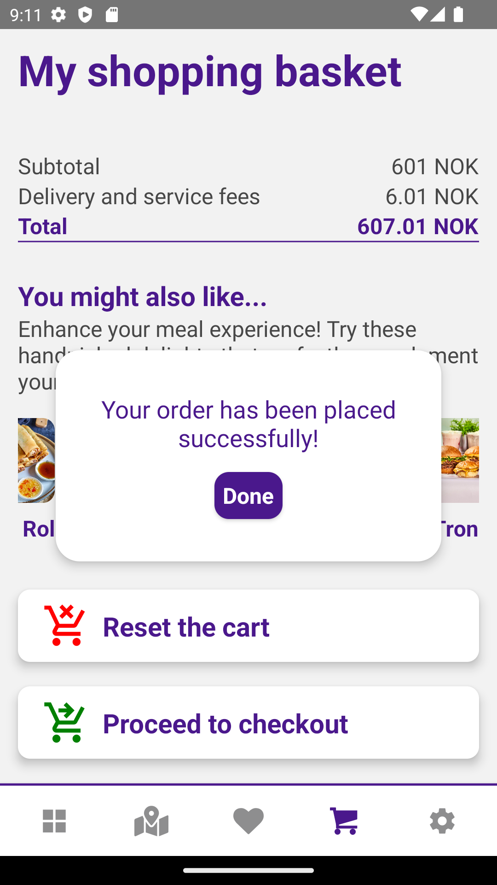
  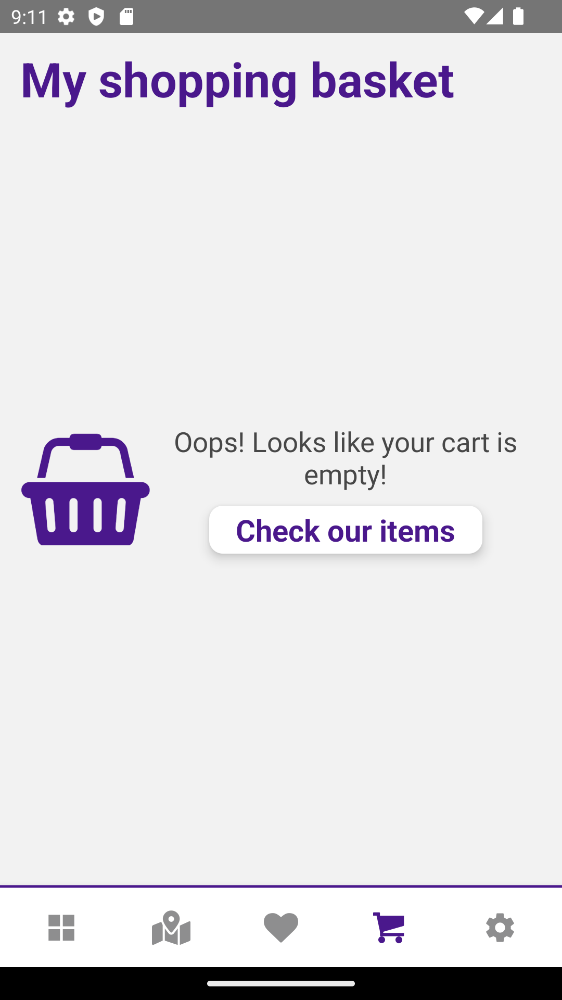

  **Figure 8.** (a) Checkout dialog.  (b) Empty cart screen.
</p>


### Settings
The Settings page is a very simple page that can be accessed from the bottom bar, and enables users to
* choose the app **language**: the supported ones are English, Norwegian and Italian;
* change the **theme**: the app colors can be switched between Light and Dark mode.

<p align="center">
  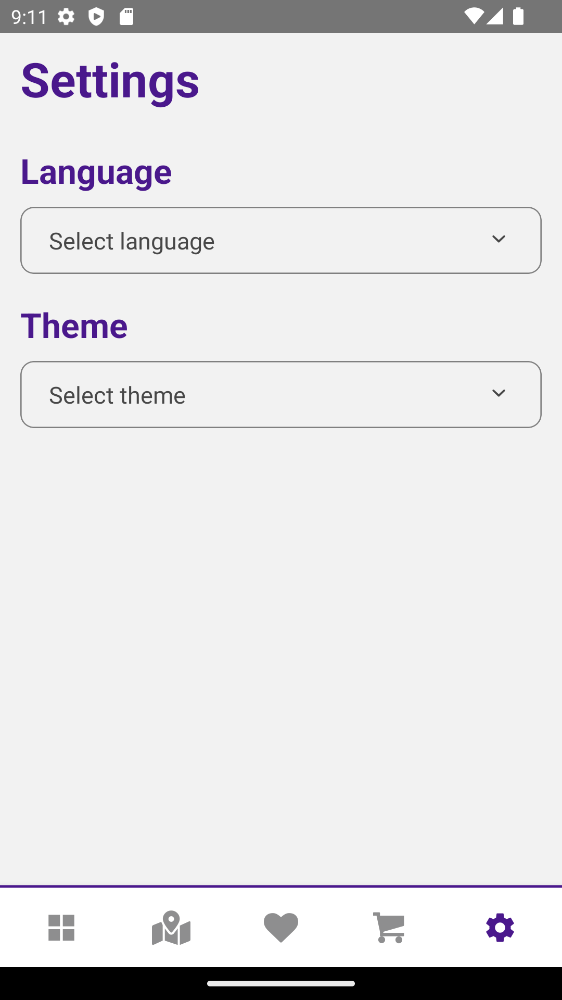
  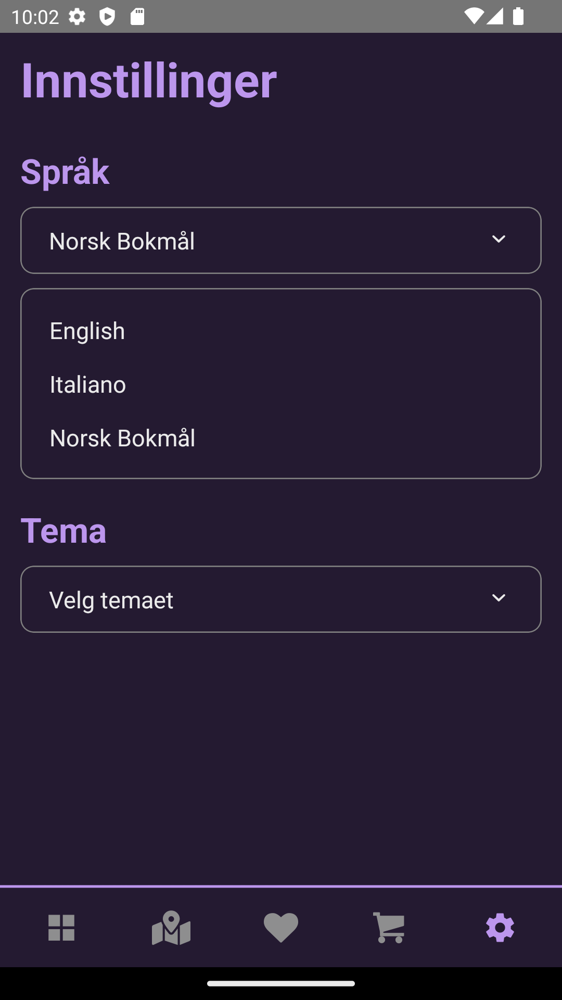

  **Figure 9.** (a) Settings page in Light mode (English).  (b) Settings page in Dark mode (Norwegian).
</p>


## Design decisions and main components
The project's folder tree is the following.
```
.
├── components/
│   ├── ItemCards/
│   │   ├── BigItemCard.js
│ 	│	  ├── ItemCard.js
│	  │   ├── SidedItemCard.js
│	  │   └── SmallItemCard.js
│   ├── CartButton.js
│   ├── CheckboxCategory.js
│   ├── EmptyCart.js
│   ├── LanguageSelector.js
│   ├── ModalWindow.js
│   ├── PictureGallery.js
│   ├── ThemeSelector.js
│   ├── Title.js
│   └── UpperBar.js
├── data/
│   └── db.json
├── images/items
├── screens/
│   ├── Bookmarks.tsx
│   ├── Filter.tsx
│   ├── Homepage.tsx
│   ├── ItemDetails.tsx
│   ├── MapScreen.tsx
│   ├── Settings.tsx
│   └── ShoppingCart.tsx
├── translations/
│   ├── en-GB.json
│   ├── I18n.js
│   ├── it-IT.json
│   └── nb-NO.json
├── App.tsx
├── Globals.js
├── index.js
└── Palette.js
```
I have chosen to map every page of the application with a screen `.tsx` file (i.e., those in the `screens` folder) in order to keep the logic of each page separate.

The `db.json` file contains all the information related to items, cart and bookmarks. I used the **json-server** library to create a mock REST API server using my file as source data, and I exposed it to the Internet with the **ngrok** tool. In fact, the server address included in  `Globals.js` is the URL provided by ngrok.
What is basically done in each page is retrieving items, cart or bookmark information by **fetching** from the server through requests with `GET`, `DELETE`, `POST` or `PATCH` methods.

After updating the respective state variables the page is rendered, the **useEffect** hook is used to trigger side effects, mainly fetching data to update (**useState**) the values because of a change in one specific variable, or after a set time interval.

As per the several **components**, I have created them with different purposes. Some for the sake of reusability, as they are used multiple times in the app (e.g. `Title.js`, and the different item cards); others because I wanted to lighten the code of screen files and make it more readable (e.g. theme and language selectors or `ModalWindow.js`, which are only used once). 

In the components I imported different React Native **packages**:
* `@react-native-community/checkbox` for the category selection in the Filters page;
* `react-native-image-modal` for the image gallery in the Item Details page;
* `react-native-dropdown-select-list` for the dropdown menus through which users can select language and app colors in the Settings page;
* `react-native-maps` to implement the map view of the landing page. 

In particular, as I developed for Android, to visualize the Google Maps map, I had to include the **API key**, adding the following lines in the `AndroidManifest.xml` file: 
 ```bash
 <meta-data
	android:name="com.google.android.geo.API_KEY"
	android:value="my_API_key"/>
 ```

For the UI, I mainly took inspiration from the **Foodora App** and the wireframes provided in the project specifications.
The Light palette is the default one when installing the app, and the colors are in the tone of purple/lilac.
For the Dark mode, I have decided not to simply invert the colors but to arrange another palette.
The change is handled retrieving the selected tone from the **Async storage** and passing it to the components as `prop`. Then the specific colors are set through the use of `Palette.js`, which contains both colors and style properties that change when switching from Light to Dark mode.

The Async storage also contains the information related to the language. When the user first installs the app, the language will be that of the system, retrieved with `react-native-localize`. Then, if they change it (in the Settings screen), the value is saved in the storage and acquired from there.
All translations and configuration files for the **internationalization** are located in the `translations` folder.

I do not own the **images** used in this app and contained in the `images/items` folder. They are sourced from the internet and the credits go to their respective owners.
The stylized food logo that can be seen in the app icon or during the loading was created using flaticon.com.

## Launching the app
### Database server & ngrok
To start the **json-server** using the `db.json` file as data source (already set up with some products and items in the cart and in the bookmarks),
```bash
npm run mockapi
```

To start the **ngrok** tunnel for handling HTTPS requests,
```bash
ngrok http 3000
```

### Metro server
```bash
npm start
```
#### Android
To run the app from Android device,
```bash
npm run android
```
And add the API key as mentioned in the previous section.
